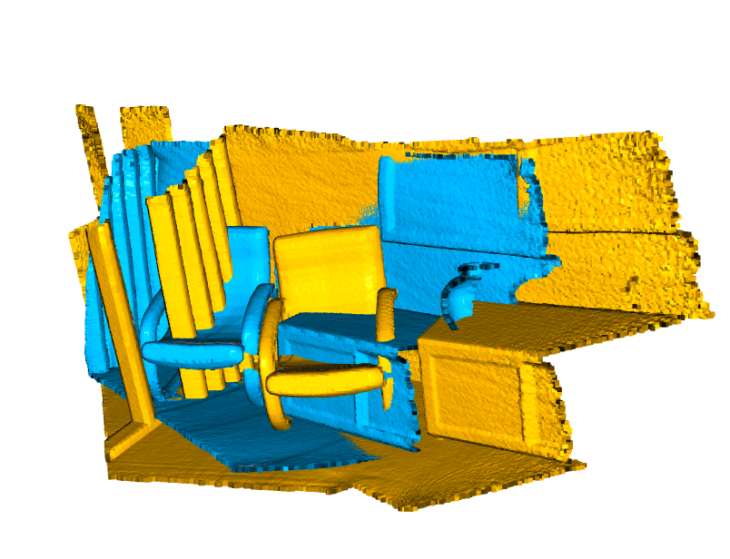
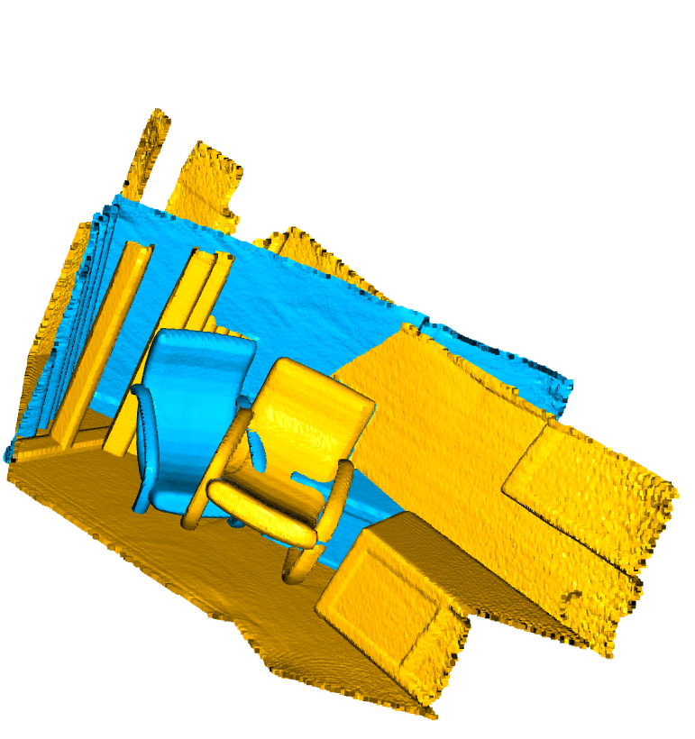
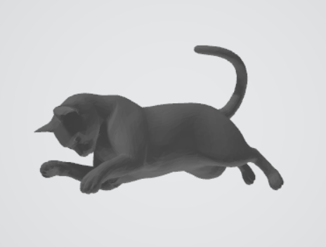
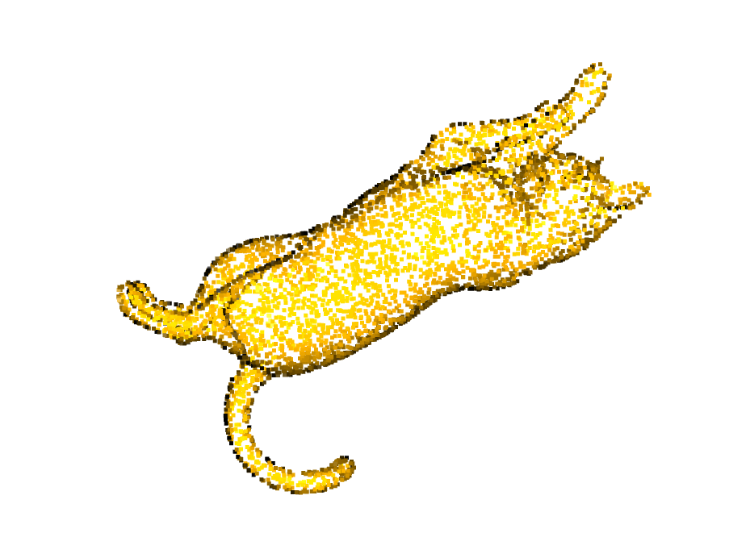
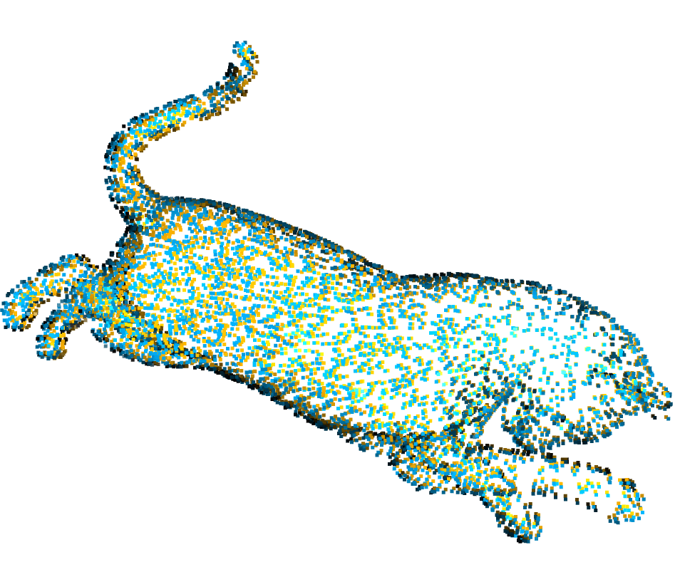
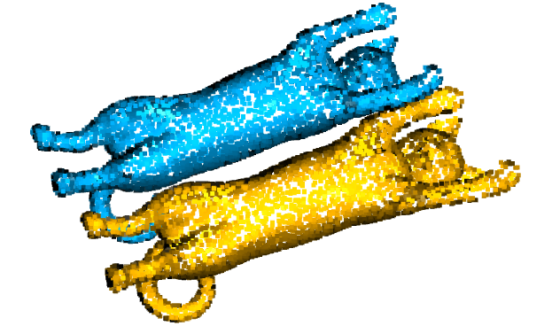

# Iterative Closest Point (ICP) from Scratch

A from-scratch implementation of **point-to-point ICP** for 3D point cloud registration, written in Python with NumPy and Open3D (Open3D is used only for I/O, KD-tree search and visualization, not for the registration itself).

The notebook has two parts:

- **Part A**: align two real-world point clouds from Open3D's demo dataset.
- **Part B**: validate the algorithm on a 3D cat mesh with a known ground-truth transformation.

## How it works

ICP repeats the following steps until the alignment stops improving:

1. **Correspondences**: for every source point, find its nearest neighbour in the target cloud using a KD-tree (`KDTreeFlann`).
2. **Transform estimation**: center both matched point sets on their centroids, build the cross-covariance matrix `H = Sᵀ T`, and solve for the optimal rotation with **SVD** (Kabsch algorithm): `R = V Uᵀ`. A reflection check (`det(R) < 0`) flips the last row of `Vᵀ` to guarantee a proper rotation. Translation is `t = c_target − R · c_source`.
3. **Apply and accumulate**: transform the source cloud and compose the result into the total 4×4 homogeneous matrix `T_total = T · T_total`.
4. **Check convergence**: stop when the change in mean squared error between two iterations falls below `1e-4` (max 50 iterations).

```python
T = icp(source, target)   # source is aligned in place, returns the 4x4 transform
```

## Results

### Part A: Open3D demo point clouds

The cost drops quickly and converges after 12 iterations:

| Iteration | Mean squared error |
|-----------|--------------------|
| 0         | 0.1232             |
| 5         | 0.0470             |
| 11        | 0.0451 (converged) |

Estimated transformation:

```
[[ 0.832 -0.019 -0.554  1.376]
 [-0.175  0.940 -0.294  0.990]
 [ 0.526  0.342  0.779 -1.405]
 [ 0.     0.     0.     1.   ]]
```

The final error does not reach zero because the two scans only partially overlap and plain point-to-point ICP has no outlier rejection.

### Part B: Cat mesh with known transformation

A cat mesh is sampled to 5,000 points, then a known rotation (`xyz = 0.5, 0.2, 0.1` rad) and translation (`[0.3, -0.4, 0.2]`) are applied to create the target. ICP recovers the transformation almost exactly:

| Metric            | Value      |
|-------------------|------------|
| Rotation error    | 5.7e-15    |
| Translation error | 8.1e-14    |
| Converged after   | 26 iterations |

> **Note:** source and target are the same sampled points, so correspondences are exact by construction. This part is a correctness test of the implementation, not a benchmark of real-world robustness.

## Getting started

```bash
git clone https://github.com/Zeineb19/<repo-name>.git
cd <repo-name>
pip install open3d numpy jupyter
jupyter notebook icp.ipynb
```

Part A downloads its data automatically through `o3d.data.DemoICPPointClouds()`.

For Part B, place your `.obj` mesh in the repo folder and update the path in the notebook:

```python
mesh = o3d.io.read_triangle_mesh("cat1_un4.obj")
```

## Visualizations

Yellow is the **source**, blue is the **target**.

### Before / After ICP

| | Before ICP | After ICP |
|---|---|---|
| **Part A** (demo scans) |  |  |
| **Part B** (cat mesh) |  |  |

### Why only one color is visible after alignment

When ICP converges perfectly (Part B), source and target points coincide exactly, so the viewer draws one cloud on top of the other and **only one color is visible**. This is the expected sign of a perfect alignment, not a rendering bug.

To prove that both clouds are really superimposed, a **small translation** (5% of the object width along X) is applied to the source after ICP. Both colors then appear interleaved on the same shape:

| Perfect alignment (one color) | Small translation (both colors visible) | Large translation (60%, clouds separated) |
|---|---|---|
|  |  |  |

```python
shifted_pts[:, 0] += bbox_size[0] * 0.05   # small shift: overlap check
shifted_pts[:, 0] += bbox_size[0] * 0.60   # large shift: separate the clouds
```

## Limitations and possible improvements

- ICP only converges to the nearest local minimum, so it needs a reasonable initial alignment.
- No outlier or distance-threshold rejection for correspondences.
- Point-to-plane error metric (faster convergence on smooth surfaces).
- Coarse-to-fine registration, or a global method (e.g. FPFH + RANSAC) to provide the initial guess.

## Tech stack

Python 3.10 · NumPy · Open3D · Jupyter

## Author

**Zeineb** · [GitHub](https://github.com/Zeineb19)
